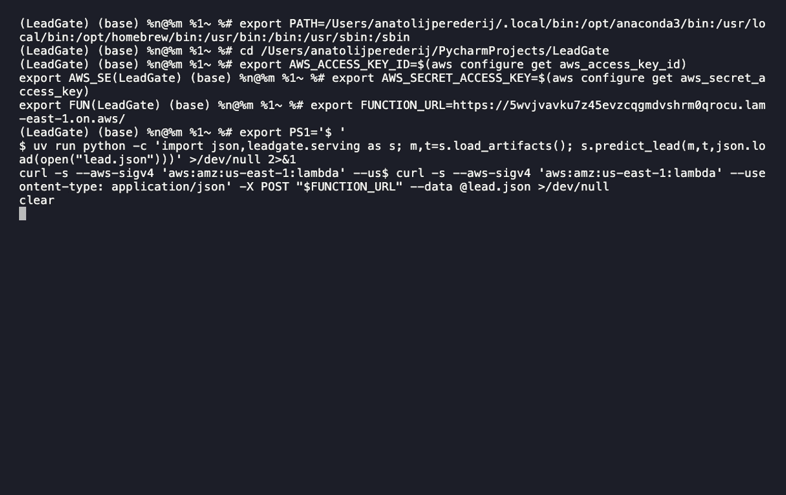
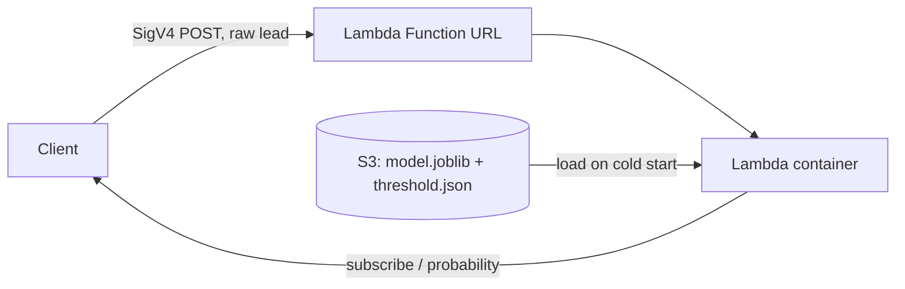

# LeadGate

Lead scoring for bank telemarketing: predicts who subscribes to a term deposit, trained on
45k real calls (UCI Bank Marketing) and served via S3 -> Lambda -> Function URL.

Built on one constraint: **no feature the call centre couldn't know before dialling.** That
rules out the dataset's single strongest predictor - the call's own duration - which is only
known *after* the call it's supposed to help decide. The API contract has no field for it,
and that absence is the proof, not a corner cut.



*One raw lead in -> a call decision out. The same `model.joblib` returns an identical answer from
local disk and from the deployed Lambda (SigV4-signed Function URL).*

## Problem statement

- **Task:** binary classification - will a client subscribe to a term deposit after a call.
- **Unit of observation:** a single contact (the last call of a campaign to a client), not a client.
- **Target:** `y` (`yes` = subscribed). Positive rate **11.7%** (5,289 / 45,211).
- **Metric:** PR-AUC (`average_precision`) + minority-class recall. *Not* accuracy - the
  "nobody subscribes" constant already scores **88.3%**.
- **Baseline:** `DummyClassifier(strategy="most_frequent")` and `LogisticRegression`.
- **Threshold:** not 0.5 - tuned on out-of-fold predictions, never on the test set.

**Business framing:** call prioritisation - the model tells the call centre who to dial first.

## Data

UCI Bank Marketing - **`bank-full.csv`**: 45,211 rows, 16 features + target. Real Portuguese
bank telemarketing campaigns, May 2008 - November 2010, ordered by date.
Source: <https://archive.ics.uci.edu/dataset/222/bank+marketing>

> ⚠️ Use `bank-full.csv`, **not** `bank-additional-full.csv`. In the latter, after dropping
> `duration`, the strongest remaining predictors are month-level macro indicators identical
> for every client in a month - a random split then peeks into the future. `bank-full.csv`
> doesn't carry those columns.

Raw data is git-ignored and lives in `data/raw/` (immutable; never edited).

### Data dictionary

From `bank-names.txt` in the archive.

| Feature | Type | Meaning |
|---|---|---|
| `age` | numeric | Client age |
| `job` | categorical | Type of job |
| `marital` | categorical | Marital status |
| `education` | categorical | Education level |
| `default` | categorical | Has credit in default? |
| `balance` | numeric | Average yearly balance (€) |
| `housing` | categorical | Has a housing loan? |
| `loan` | categorical | Has a personal loan? |
| `contact` | categorical | Contact communication type |
| `day` | numeric | Last contact day of the month |
| `month` | categorical | Last contact month |
| `duration` | numeric | Last contact duration (seconds) - **dropped: leakage, unknown before the call** |
| `campaign` | numeric | Contacts during this campaign (incl. last) |
| `pdays` | numeric | Days since last contact in a previous campaign (`-1` = not previously contacted) |
| `previous` | numeric | Contacts before this campaign |
| `poutcome` | categorical | Outcome of the previous campaign |
| `y` | target | Subscribed a term deposit? (`yes` / `no`) |

## Key findings (EDA)

- **Class imbalance:** 11.7% positives (5,289 / 45,211) - drives the PR-AUC choice; a constant
  "no" already scores 88.3% accuracy.
- **`duration` is a leak -> dropped.** The single strongest signal (event rate climbs 0.2% -> 45%
  across deciles, Spearman 0.34), but it's known only *after* the call and the causality is
  reversed (an interested client causes a long call). Found by hand, then confirmed by the docs.
- **`pdays` ≈ `previous` (ρ = 0.99).** They share the `-1` "never contacted" sentinel and are
  collinear -> keep `previous`, drop `pdays`.
- **`unknown` means two different things.** In `poutcome` (81.7%) it's information - "no prior
  campaign", the same rows as `pdays = -1`; in `education` / `job` it's a genuine missing value.
- **`balance`** is right-skewed with negative values -> `PowerTransformer("yeo-johnson")` (plain
  `log` fails on negatives).
- **`age`** is U-shaped (young and senior subscribe more) -> binned, not fed raw to a linear model.
- **`month`** is kept (known before the call) but confounded - three years are collapsed into 12
  labels, so it isn't clean seasonality.

Full per-feature verdicts and the analysis: `notebooks/01-eda.ipynb`.

## Preprocessing (PR3)

Turns the EDA verdicts into a single `ColumnTransformer`, fit on **train only**:

- **Dropped:** `duration` (leakage), `day` (noise), `pdays` (ρ = 0.99 with `previous`).
- **Cleaned:** 5 rows where `poutcome = unknown` contradicts `previous > 0` -> 45,206 rows.
- **Encoded:** 9 categoricals -> `OneHotEncoder(handle_unknown="ignore")`; `age` -> 5 quantile
  bins -> OHE (captures the U-shape); `campaign` / `previous` passed through raw.
- **Transformed:** `balance` -> `PowerTransformer("yeo-johnson")` (right-skew with negatives).
- **Split:** stratified 80/20 (`random_state=42`) - the test set is never touched by any `fit`.
- **No outlier removal:** extreme values are real; deleting them would bias the model and drop
  minority-class rows. Skew is handled by the transforms, not by deletion.

Output: **52 features**. The fitted transformer is saved to `models/preprocessor.joblib` for the
serving pipeline; processed splits go to `data/processed/` (git-ignored, regenerable).

## Baseline models (PR4)

The preprocessor is **rebuilt unfitted** and dropped into a `Pipeline([("preprocessor", ct),
("model", …)])`, so cross-validation re-fits it inside every fold - no leakage. The saved
`preprocessor.joblib` is for serving, never for scoring. Metric is PR-AUC (`average_precision`);
the test set is not touched here - it is opened once, in PR8.

- **Floor - `DummyClassifier("most_frequent")`:** PR-AUC = **0.117**, i.e. the positive rate.
  Anything at or below this has learned nothing.
- **`LogisticRegression(class_weight="balanced")`:** PR-AUC = **0.40 ± 0.03** (5-fold stratified
  CV on train) - **~3.4×** the floor.
- **Out-of-fold at the default 0.5 threshold:** minority-class recall **0.63** / precision **0.27**
  - flags most subscribers, but with many false positives.

`class_weight="balanced"` offsets the 11.7% imbalance so the model doesn't collapse to "always
no". The 0.5 threshold is left untouched - tuning it on out-of-fold predictions is a later PR.
PR curve (out-of-fold): `reports/figures/cv-PR-AUC.png`.

## Model comparison (PR5)

Do tree models beat the logistic-regression baseline? Same protocol - 5-fold stratified
CV on train, PR-AUC, test untouched.

- **RandomForest** (ordinal categoricals, raw numerics): **0.38** - below the LogReg
  baseline. Trees gain nothing from OHE/binning/scaling, and the signal is too simple for
  RF to exploit.
- **HistGradientBoosting** (native categoricals, raw numerics): **0.42** - the strongest,
  but only marginally above LogReg's **0.40**, and within one CV std.
- **Light `RandomizedSearchCV` on HGB:** stays ~0.42. Tuning moves nothing; the ~0.42
  ceiling is confirmed.

**Decision:** keep **LogisticRegression** for serving. At a statistical tie the cheaper,
faster, interpretable model wins - **0.40 ± 0.03** against HGB's **~0.42**, both cross-validated
on train. HGB's marginal edge doesn't justify a heavier, opaque artifact on Lambda.

## Imbalance handling (PR6)

At 11.7% positives, does reweighting or resampling beat leaving the class ratio alone? Same
protocol - champion (LogReg), 5-fold stratified CV on train, PR-AUC, test untouched. Resamplers
sit **inside** an `imblearn.Pipeline`, so they touch only the training folds; the validation fold
keeps its real 11.7% ratio (resampling it would leak synthetic points into the score).

| Strategy | CV PR-AUC |
|---|---|
| None (no reweighting) | **0.402 ± 0.026** |
| `class_weight="balanced"` | 0.400 ± 0.025 |
| SMOTE (after one-hot) | 0.398 ± 0.025 |
| SMOTENC (native categoricals) | 0.357 ± 0.019 |

**None, `class_weight` and SMOTE are a statistical tie** - a 0.004 spread inside one CV std
(~0.025). SMOTENC is clearly *worse*: to reach 50/50 it synthesises ~4× the minority rows on data
that is 9 of 13 columns categorical, distorting the decision boundary more than any reweighting
fixes.

Why resampling buys nothing here: **PR-AUC scores ranking, and imbalance doesn't break ranking -
it breaks the threshold.** Reweighting and resampling move where the "0.5" line falls, not the
order of the ranked call list, so a ranking metric can't reward them and the synthetic noise can
only cost. This is the expected result at a moderate 11.7% (SMOTE earns its keep below ~1%).

**Decision: keep `class_weight="balanced"` - not because it wins PR-AUC (it ties), but because it
fixes the operating point for free.** Fit on the true ratio, plain LogReg outputs probabilities
averaging **0.117** - the base rate, well-calibrated, but so low that at threshold 0.5 it flags
almost nobody (recall ≈ 0). `class_weight="balanced"` inflates them to average **0.41**, making the
default threshold usable. SMOTE/SMOTENC are rejected: more machinery and synthetic data for a lower
or equal score. The operating point itself - the real lever for a call list - is tuned on
out-of-fold predictions in PR7, not here.

Analysis: `notebooks/05-imbalance.ipynb`.

## Operating point (PR7)

PR-AUC rates the *ranking*; it says nothing about **where to cut the ranked call list**. That
cut - the threshold - is the real lever for a call centre, and 0.5 is arbitrary. PR7 sets it from
business economics on out-of-fold predictions (same 5-fold CV, `cross_val_predict`), test untouched.

**Cost model (illustrative figures):** €100 profit per subscription, €10 per call attempt. For a
threshold `t`, profit = `TP·100 - calls·10`. Sweep `t`, keep the max.

**`class_weight` dropped - the threshold makes it redundant.** It only ever existed to rescue the
default 0.5 (PR6). Tuning the threshold explicitly does that job directly, so PR7 switches to
**plain, unweighted `LogisticRegression`**, which returns *calibrated* probabilities. The two are
equivalent for the decision: identical ranking (PR6), so the same clients are called for the same
profit - only the threshold *number* differs (0.11 on the plain scale vs ~0.50 on the balanced one).

| Scenario | Threshold | Calls | Recall | Precision | Profit |
|---|---|---|---|---|---|
| Unlimited (economic optimum) | **0.11** | 11,727 (⅓ of leads) | 0.67 | 0.24 | €167k |
| Capacity 2,000/day (top-N) | ~0.37 | 2,004 | 0.27 | **0.56** | €93k |

Two readings of one ranked list. **Unlimited:** call everyone still profitable - the optimum lands
at **0.11 ≈ the break-even `c/v` = 0.1**, catching two-thirds of subscribers at precision **0.24**
(2× the 11.7% base rate). **Under a 2,000-call cap** you skim the top: precision jumps to **0.56** -
one call in two converts - because when calls are scarce, ranking quality (the PR-AUC of PR5/6) pays
off directly.

**Policy: floor + capacity.** 0.11 is an *economic floor* - below it each marginal call loses money,
so never go lower. Capacity decides how far down toward it you reach: `t = max(0.11, top-N cut)`.
Only the floor is frozen (`models/threshold.json`); the daily call budget is a runtime input.

**Calibration check.** The decision leans on the probability *equalling* the break-even, so plain
LogReg's calibration is verified on OOF predictions: the reliability curve tracks the diagonal and
the Brier score is **0.086** - well-calibrated, and notably so around the 0.1 operating region. A
predicted 0.11 really is a ~11% chance, so the cost-based threshold isn't lying; no
`CalibratedClassifierCV` needed. Reliability diagram: `reports/figures/calibration.png`.

Threshold **0.11** is frozen and applied once to the held-out test in PR8.
Analysis: `notebooks/06-threshold.ipynb`.

## Final evaluation (PR8)

The test set - held out in PR3 and untouched since - is scored **once**. PR7's champion (plain
`LogisticRegression` in the leakage-free `Pipeline`) is fitted on the full training set, the
threshold is read from `models/threshold.json` rather than retyped, and applied as-is. Nothing was
tuned after these numbers were seen.

**Test set:** 9,042 leads, 1,057 subscribers - base rate **11.7%**, matching train.

| Ranking metric | CV (train) | Test |
|---|---|---|
| PR-AUC | 0.40 | **0.417** |
| ROC-AUC | - | **0.775** |

**Confusion matrix at t = 0.11:**

|  | predicted: don't call | predicted: call |
|---|---|---|
| **actual: no** | 5,741 | 2,244 |
| **actual: yes** | 330 | **727** |

**Did the operating point survive contact with unseen data?** This is the question PR8 exists to
answer - the threshold was chosen on out-of-fold predictions, so it could easily have been tuned to
noise.

| At t = 0.11 | OOF forecast (PR7) | Test (actual) |
|---|---|---|
| Calls | 11,727 - 32.4% of leads | 2,971 - **32.9%** |
| Recall | 0.67 | **0.69** |
| Precision | 0.24 | **0.24** |
| Profit per lead | €4.61 | **€4.75** |

**It transferred essentially unchanged.** Same share of the list called, same precision, recall a
point higher, and **3% more profit per lead than forecast** (€42,990 over 9,042 leads). Absolute
euros aren't comparable across sets - the test is a quarter the size - so profit is normalised per
lead. A threshold picked by sweeping OOF predictions is exactly the kind of choice that overfits
quietly; this one didn't.

**The 2,244 false positives are the design, not a defect.** At 24% precision three in four calls
are wasted - but a wasted call costs €10 and a caught subscriber earns €100, so the model is
correctly buying cheap mistakes to avoid expensive misses. Optimising precision here would destroy
value. The same logic makes overall accuracy (0.72) meaningless: predicting "never call" scores
88% and earns nothing.

**Why ROC-AUC reads higher than PR-AUC.** With 88% negatives, the true-negative block inflates
ROC-AUC; PR-AUC ignores it and measures only the ranked call list, which is the thing a call centre
actually consumes. Both are reported, PR-AUC is the one that governs. Curves:
`reports/figures/test-PR-AUC.png`, `reports/figures/test-ROC-AUC.png`.

**Scope.** A single stratified random split. `bank-full.csv` is chronologically ordered, so a
time-based split (train on the early campaign, test on the late) would be the stronger validation
and would expose any drift the random split hides - it is deliberately out of scope here.

The fitted pipeline is saved to `models/model.joblib` - preprocessing and model in one artifact, so
serving passes a raw lead in and gets a probability out. It supersedes `models/preprocessor.joblib`
from PR3.

Analysis: `notebooks/07-evaluation.ipynb`.

## Interpretation (PR9)

The champion is linear, so it explains itself: each fitted coefficient, exponentiated, is an
**odds ratio** - the multiplicative change in the odds of "subscribes" when that feature is on.
No SHAP, no surrogate model; for a `LogisticRegression` the coefficients *are* the attribution.

**Top positive drivers (OR > 1):**

| Feature | Odds ratio |
|---|---|
| `poutcome = success` | **4.49** |
| `month = mar` | 3.00 |
| `month = sep / oct / dec` | 1.87-1.96 |
| `job = retired` | 1.47 |
| `contact = cellular` | 1.43 |

**Top negative drivers (OR < 1):** `month = jan` (0.37), `contact = unknown` (0.40),
`poutcome = failure` (0.48), `housing = yes` (0.63), `loan = yes` (0.69), `default = yes` (0.78).

**The one signal that's both strong and actionable is `poutcome = success`** - a client who took a
term deposit in a prior campaign has **~4.5× the odds** of subscribing again. It's the model's
single clearest, causally-sensible lever, and it sits well above every other feature.

**Month is predictive but not a lever.** Five of the ten largest ORs are month dummies, but
`month` encodes *when past campaigns ran*, not a property of the client - the high-OR months (mar,
sep, oct, dec) were low-volume, selectively-contacted months, so their lift is selection, not
seasonal magic. It earns its place in the *ranking* (it's known before the call, so it stays in the
model) but the interpretation reads it as campaign-timing context, not "dial everyone in March."
Consistent with the EDA note that three years collapse into 12 labels - this isn't clean seasonality.

**Comparability.** The drivers above are all one-hot dummies (0/1), so their ORs are directly
comparable. The passthrough numerics (`balance`, `campaign`, `previous`) sit near 1.0 because their
OR is *per unit* - a different scale, not necessarily weak - and mustn't be ranked against the dummies.

Interpretation shares the evaluation notebook (no separate `08`): `notebooks/07-evaluation.ipynb`.

## Serving (PR12)

The champion is served as an AWS **Lambda container image** - `LogisticRegression` and its
preprocessing travel together in `model.joblib`, so the function takes a raw lead and returns a
decision. sklearn is too large for a Lambda zip, hence the container (base
`public.ecr.aws/lambda/python:3.12`, pushed to ECR).



**Model delivery.** The fitted pipeline and `threshold.json` sit in S3; the handler pulls them to
`/tmp` on cold start and caches them for warm invocations. The bucket arrives as the
`LEADGATE_S3_BUCKET` env var - unset, the same code loads from local `models/`, so dev and tests
never touch S3. The Lambda role grants only `s3:GetObject` (least privilege).

**Request** - exactly the 13 features the model trained on. `duration`, `day` and `pdays` have no
field: they were dropped in preprocessing, and `duration`'s absence is the whole point - it can't
be known before the call, so the contract can't ask for it.

```json
{ "age": 41, "balance": 1250, "campaign": 2, "previous": 0,
  "job": "technician", "marital": "married", "education": "secondary",
  "default": "no", "housing": "yes", "loan": "no",
  "contact": "cellular", "month": "may", "poutcome": "unknown" }
```

**Response** - the decision, the probability, and the frozen threshold it was compared against:

```json
{ "subscribe": false, "probability": 0.083, "threshold": 0.11 }
```

Bad input fails loud: a missing or unexpected field is a `400`; an unknown category
(`job: "spaceman"`) is absorbed by `OneHotEncoder(handle_unknown="ignore")` and scored anyway.

**Endpoint.** A Lambda Function URL. Public (`AuthType=NONE`) URLs are blocked by an account-level
guardrail, so it uses `AuthType=AWS_IAM` and requests are SigV4-signed:

```bash
curl --aws-sigv4 "aws:amz:us-east-1:lambda" \
  --user "$AWS_ACCESS_KEY_ID:$AWS_SECRET_ACCESS_KEY" \
  -X POST "$FUNCTION_URL" --data @lead.json
```

Handler and inference live in `src/leadgate/handler.py` and `src/leadgate/serving.py`; the image
is built from `Dockerfile`.

## Layout

```
data/
  raw/          # immutable source (bank-full.csv, git-ignored)
  processed/    # final datasets for models
notebooks/
  01-eda.ipynb
  02-preprocessing.ipynb
  03-baseline.ipynb
  04-models.ipynb
  05-imbalance.ipynb
  06-threshold.ipynb
  07-evaluation.ipynb
src/leadgate/     # shared helpers, imported by the notebooks and by serving
  data.py         # load_raw, clean_raw, load_preprocessed
  pipeline.py     # make_preprocessor, make_cv, make_champion_pipeline
  threshold.py    # calculate_profit, threshold_sweep, pick_best
  serving.py      # load_artifacts (local or S3), predict_lead
  handler.py      # AWS Lambda entrypoint
models/           # model.joblib (fitted pipeline) + threshold.json
reports/figures/
tests/            # pytest suite for src/leadgate
Dockerfile        # Lambda container image
```

## Getting started

```bash
uv sync          # install dependencies and the leadgate package itself
uv run pytest    # run the test suite
```
